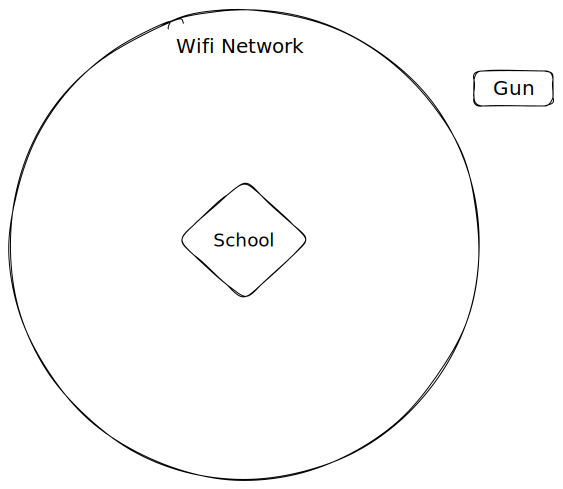

# Wide-area Gun Detection System

This memo contains a system designed to deliver timely notifications to the authorities when a firearm comes close to a Public structure, known as the "Wide-area Gun Detection System," or WAGS for short. Use this system as part of a more significant threat response plan.

WAGS' architecture employs know-how from various disciplines, such as cloud engineering, community organizing, Human services, and information architecture. A successful deployment of WAGS creates a Public Good that benefits geographies on the scale of districts, townships, cities, and counties.&#x20;

Here are the initial specifications used to get the problem-solving ball rolling:

* The system MUST detect unconcealed firearms outside of the structure.
* The system MUST collect and send data to authorities and staff, who will determine the appropriate response.
* The system MUST take into account firearms already in circulation.

### Wide-area Detections

For Wide-area Detection at Public buildings such as schools and libraries, the system would require sending digital and analog signals to systems connected to existing wireless or wired networks.

The WAGS deployment requires a network with Internet access available and reliable within the desired radius of the structure (e.g., 50 meters). The network's makeup may include existing hardware, software, wired or wireless setups.&#x20;

