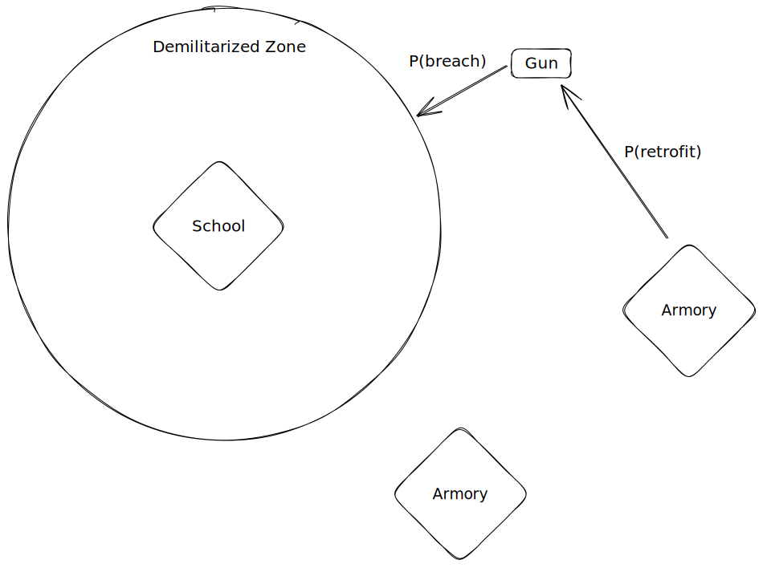

# Wide-area Gun Detection System

This memo contains a system designed to deliver timely notifications to the authorities when a firearm comes close to a Public structure, known as the "Wide-area Gun Detection System," or WAGS for short. Use this system as part of a more significant threat response plan.

WAGS' architecture employs know-how from various disciplines, such as cloud engineering, community organizing, Human services, and information architecture. A successful deployment of WAGS creates a Public Good that benefits geographies on the scale of districts, townships, cities, and counties.&#x20;

Here are the initial specifications used to get the problem-solving ball rolling:

* The system MUST detect unconcealed firearms outside of the structure.
* The system MUST collect and send data to authorities and staff, who will determine the appropriate response.
* The system MUST take into account firearms already in circulation.

### Wide-area Detections

For Wide-area Detection at Public buildings such as schools and libraries, the system would require sending digital and analog signals to systems connected to existing wireless or wired networks.

The WAGS deployment requires a network with Internet access available and reliable within the desired radius of the structure (e.g., 50 meters). The network's makeup may include existing hardware, software, wired and wireless setups.&#x20;

When a firearm enters the perimeter, signals collected are checked and sent to people inside the perimeter (e.g., staff, school resource officers) and computer systems/persons far outside (e.g., law enforcement, first responders, etc).&#x20;

The system that confirms the firearm's presence and sends notifications to recipients can be built using cloud-native protocols such as MQTT, TCP/IP, and UDP suitable for timely communication of events over large distances. Internal perimeter communication can leverage digital and analog communication tools such as cellular, radio, and wifi.

### Designing markers for firearms

The choice of markers for firearms will drive the deployment of portions of the internal perimeter communication of WAGS. This document assumes that markers are strictly designed to detect perimeter breaches and not necessarily to identify the firearm user or triangulate the firearm's location relative to the structure. As a part of the effort to design a marker, the implementer must remember that it must be possible to retrofit existing firearms with a marker.

Obtaining the makers requires specific engineering effort that may require Private-Public partnerships and 'Wisdom of the Crowd' techniques such as Hackathons.

### Community-driven retrofitting of firearms

The retrofitting program aims to increase the percentage of guns in circulation with markers detectable by WAGS. This document suggests that the community has the critical role of retrofitting firearms already in circulation. Similar to the 'gun buy-back program' model, a community retrofitting program would provide incentives to individuals who participate. Furthermore, a 'no-questions asked' policy would help ensure confidence that participation does not lead to persecution.

Community-driven retrofitting is to occur at locations outside of the WAGS detection area, labeled on the graphic as "Armory." The sole purpose of permanent and temporary armories is to provide a communal location where retrofitting can occur and to distribute incentives to participants.

### Partnerships with Gun Manufacturers
